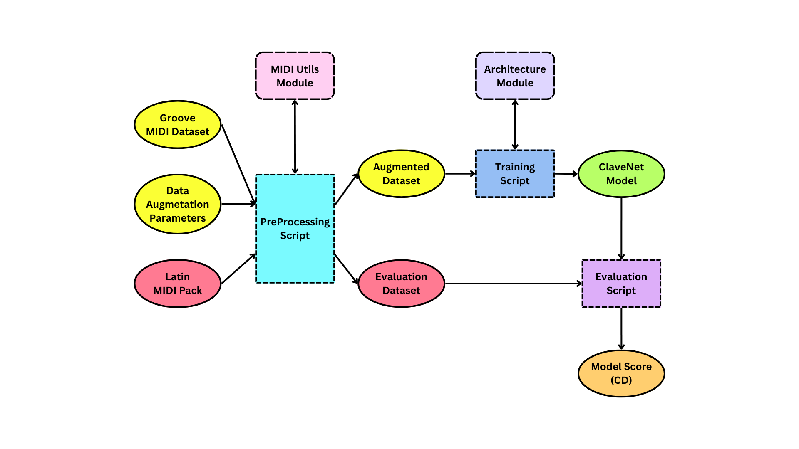

# CLAVENET: Generating Afro-Cuban Drum Patterns through Data Augmentation

ClaveNet is generative MIDI model for Afro-Cuban percussion. ClaveNet is the culmination of a project seeking to overcome the scarcity of Afro-Cuban MIDI drum data in publicly-available-datasets for the purposes of training a cocreative, generative percussive model. We trained ClaveNet with the help of a novel data augmentation scheme that infuses Afro-Cuban drum patterns into a MIDI percussion dataset.

This repo links several subrepos housing a variety of objects, functions, and scripts integral to the design and implementation of ClaveNet.

You can listen to some ClaveNet samples [**here!**](https://dafg05.github.io/ClaveNet-Samples/)

## Data flow

### Data Preprocessing

A module containing the preprocessing script used to convert the Groove MIDI Dataset into Afro-Cuban-influenced augmented datasets, comprised of HVO-Sequences. You can specify the data augmentation parameters used for preprocessing. The augmented datasets are later used by the Training module to create ClaveNet models. Moreover, this module contains a script for preprocessing an Evaluation Set; the output of which will be used by the Model Evaluation module.
[**[Link]**](https://github.com/dafg05/ClaveNet-Preprocessing)

### Training

A module containing a script to train ClaveNet instances. This script inputs a preprocessed dataset and outputs a Pytorch ClaveNet model.
[**[Link]**](https://github.com/dafg05/ClaveNet-Training)

### Model Evaluation

An assortment of scripts to 1. perform a rhythmic-feature-based evaluation procedure that computes the distance between the generated output of ClaveNet model and a target, human-performed, evaluation dataset, and 2. to rank models based on their Cumulative Distance (CD) to the evaluation dataset. This module inputs a trained ClaveNet model and a preprocessed dataset. [**[Link]**](https://github.com/dafg05/ClaveNet-Evaluation)

### Architecture

A module containing the classes corresponding to a ClaveNet model's architecture and loss function, based on the [MGT](https://github.com/behzadhaki/MonotonicGrooveTransformer). This module is already imported in the Training module.
[**[Link]**](https://github.com/dafg05/ClaveNet-Architecture)

### MidiUtils

A module containing the transformation function essential to the Drum Data Augmentation with Seed Patterns scheme, as well as other miscellanous MIDI editing tools for working with [mido objects](https://mido.readthedocs.io/en/stable/). This module is already imported in the Data Preprocessing module, but you might find its helper tools (including trimming, spliting isolating note values, deleting note values) useful for other purposes.
[**[Link]**](https://github.com/dafg05/ClaveNet-MidiUtils) 
