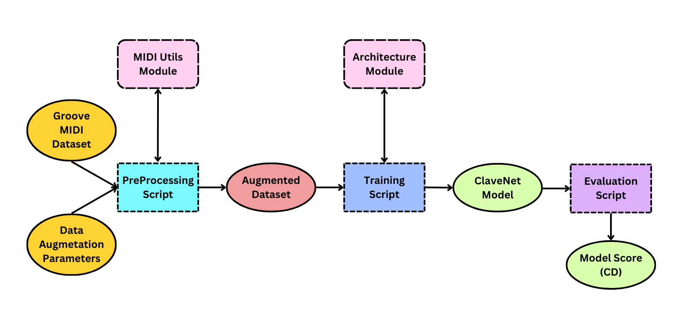

# CLAVENET: Generating Afro-Cuban Drum Patterns through Data Augmentation

ClaveNet is generative MIDI model for Afro-Cuban percussion. ClaveNet is the culmination of a project seeking to overcome the scarcity of Afro-Cuban MIDI drum data in publicly-available-datasets for the training of a cocreative, generative percussive model. We trained ClaveNet with the help of a novel data augmentation scheme that infuses Afro-Cuban drum patterns into a MIDI percussion dataset.

This repo houses subrepos housing a number of objects, functions, and scripts integral to the design and implementation of ClaveNet.

Click [**here**](https://dafg05.github.io/ClaveNet-Samples/) to listen to some ClaveNet samples!

## Data flow

### Data Pre-processing

The preprocessing script used to convert the Groove MIDI Dataset into Afro-Cuban-influenced augmented datasets, comprised of HVO-Sequences.
[**[Link]**](https://github.com/dafg05/ClaveNet-Preprocessing)

### MidiUtils

A module containing the transformation function essential to the Drum Data Augmentation with Seed Patterns scheme, as well as other miscellanous MIDI editing tools.
[**[Link]**](https://github.com/dafg05/ClaveNet-MidiUtils) 

### Model Architecture

The percussive generative model's architecture and loss function, based on the [Monotonic Groove Transformer](https://github.com/behzadhaki/MonotonicGrooveTransformer).
[**[Link]**](https://github.com/dafg05/ClaveNet-Architecture)

### Training

A script to train ClaveNet instances.
[**[Link]**](https://github.com/dafg05/ClaveNet-Training)

### Model Evaluation

An assortment of scripts to perform a rhythmic-feature based evaluation scheme for ClaveNet models, and to rank them.
[**[Link]**](https://github.com/dafg05/ClaveNet-Evaluation)
